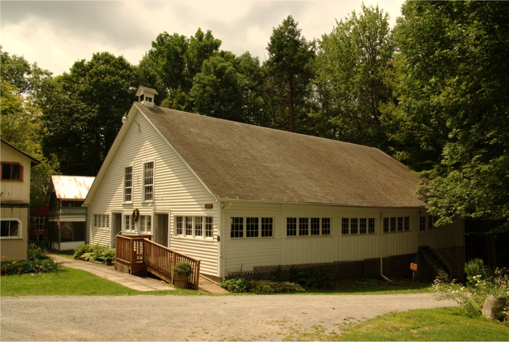

# Dimock Camp Meeting Ground — Site Notes

Static HTML site for a Methodist camp meeting ground in Dimock, PA (est. 1875).

## Stack

- **Bootstrap 5.3.1** via CDN (no local CSS files, no build step)
- No JS framework — Bootstrap bundle JS only
- Deployed via SFTP (use `deploy` skill)

## Pages

| File | Content |
|------|---------|
| `index.html` | Hero + mission/vision cards + heritage section |
| `about.html` | Tabbed: history + landmark designation; many modals |
| `services.html` | Tabbed: camp meeting / rekindling / prayer; modals |
| `events.html` | Season schedule — one card per event |
| `visit.html` | Tabbed: directions + attractions + cottages; carousel modals |
| `contact.html` | Hero + contact card |

`backup/` holds old versions — not part of the live site.

## Color scheme

Primary accent = Bootstrap `success` (green, `rgb(25, 135, 84)`). Used for navbar brand, card headers, active links, headings. Saturday events use `danger` (red); Sunday events use `success`.

## Nav pattern

Identical on every page. Copy from any existing page. Active page link gets `class="nav-link px-4 active"`.

```html
<nav class="navbar navbar-expand-lg bg-white py-4">
  <div class="container-fluid">
    <a class="navbar-brand ps-0 ps-md-4 text-success fw-bold me-2" href="/">Dimock Camp Meeting Ground</a>
    <button class="navbar-toggler border border-2 border-success px-2" type="button"
            data-bs-toggle="collapse" data-bs-target="#navbarNavAltMarkup"
            aria-controls="navbarNavAltMarkup" aria-expanded="false" aria-label="Toggle navigation">
      <span class="navbar-toggler-icon"></span>
    </button>
    <div class="collapse navbar-collapse justify-content-lg-center ps-2" id="navbarNavAltMarkup">
      <div class="navbar-nav fw-bold">
        <a class="nav-link px-4" href="about.html">About</a>
        <a class="nav-link px-4" href="services.html">Services</a>
        <a class="nav-link px-4" href="events.html">Events</a>
        <a class="nav-link px-4" href="visit.html">Visit Us</a>
        <a class="nav-link px-4" href="contact.html">Contact</a>
      </div>
    </div>
  </div>
</nav>
```

Each page also includes this `<style>` block to make the mobile toggler icon green:

```html
<style>
  .navbar-toggler-icon {
    background-image: url(
      "data:image/svg+xml;charset=utf8,%3Csvg viewBox='0 0 32 32' xmlns='http://www.w3.org/2000/svg'%3E%3Cpath stroke='rgba(25, 135, 84, 0.8)' stroke-width='2' stroke-linecap='round' stroke-miterlimit='10' d='M4 8h24M4 16h24M4 24h24'/%3E%3C/svg%3E"
    );
  }
</style>
```

## Hero pattern (index, contact)

Full-bleed image with dark overlay and text on top:

```html
<div class="position-relative overflow-hidden d-flex align-items-center" style="height: 600px;">
  
  <div class="position-absolute w-100 h-100 bg-dark bg-opacity-50"></div>
  <div class="position-relative w-100 px-3 px-md-0">
    <div class="container">
      <div class="row">
        <div class="col-12 col-md-8 col-lg-6 ms-md-auto">
          <h1 class="display-3 fw-bold text-light shadow">...</h1>
        </div>
      </div>
    </div>
  </div>
</div>
```

## Events card pattern

Each event is a card. Header color = green (Sunday) or red (Saturday). Date and title split into two columns:

```html
<div class="card shadow mb-5 border-0">
  <div class="card-header bg-success bg-gradient fw-bold d-flex p-0 rounded-0">
    <div class="bg-white text-success align-content-center py-2 px-2 px-md-4
                col-3 col-lg-2 text-center d-flex flex-column flex-md-row
                justify-content-center shadow-sm">
      <div>Sun</div>
      <div class="ms-0 ms-md-1 no-break">Aug 2</div>
    </div>
    <div class="text-white align-content-center py-2 px-3 px-md-4 col-9 col-lg-10">
      Event Title
    </div>
  </div>
  <div class="card-body bg-light">Description</div>
</div>
```

## Tab pattern (about, services, visit)

Tabs use `nav-underline`. Content lives inside a `card shadow border-0 my-5`.

## Modal pattern

Inline-trigger buttons use `btn btn-secondary`. Image-only modals use `modal-xl`; text modals use default size.
