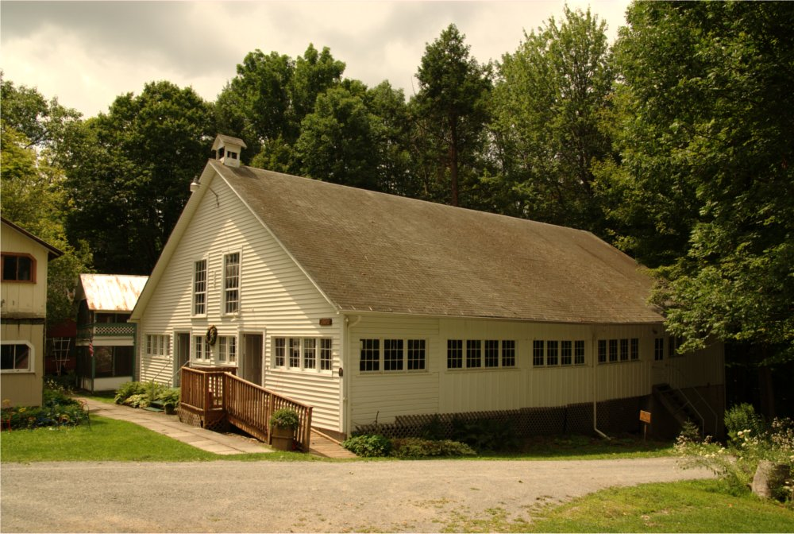

# Dimock Camp Meeting Ground — Site Notes

Static HTML site for a Methodist camp meeting ground in Dimock, PA (est. 1877).

`AGENTS.md` is a symlink to this file — edit this one.

**The founding year is 1877 — do not "fix" it to 1875.** `about.html` narrates a
lot of 1875 (the grounds were leased that July, the first camp meeting-style
preaching was August 25, 1875), so 1875 looks like the founding year from that
page alone. It is not. The grounds were chartered August 15, 1877, the signage on
the property reads "Since 1877", and the 150th year is 2027 — which only works
from 1877. `events.html` agrees: 2026 is the 149th season. Confirmed by the owner
2026-07-27. `about.html` is the source of truth for the *events* of the history,
not for the founding year.

## Design authority

**Read `docs/design-direction.md` before making any visual change**, and
`docs/redesign-plan.md` before doing any of the work. The first carries the approved
palette, typography, component system, and accessibility standards; the second is the
phased implementation plan with checkboxes tracking what has shipped. This file
describes the code as it stands today; those describe where it is going. Where they
disagree about intent, the design direction wins.

`docs/` is gitignored — those documents are local to this working copy and are not in
the repository. If they are missing, the redesign has to be replanned before it can
continue; do not guess at the direction from the code alone.

## Verifying changes

```bash
checks/run.sh            # all specs, desktop + mobile; non-zero exit on any failure
checks/run.sh --shots    # same, plus screenshots into docs/screens/ for review
```

`checks/` is a Playwright harness that serves the site on port 8811 and asserts, for
every page at 1440×900 and 390×844: no console errors, exactly one `<h1>`, and zero
horizontal overflow — plus whatever the current redesign phase has added (contrast
ratios, nav and footer identity across pages, per-page metadata). Run it before every
commit that touches HTML or CSS. A passing run is necessary but not sufficient —
`--shots` exists to be looked at.

**`checks/` is never deployed.** `.claude/commands/deploy.md` excludes it alongside
`backup/`.

Three environment facts, because each costs a turn to rediscover: Playwright is not
installed locally, so resolve it with
`eval "$(node ~/.claude/skills/playwright-gotchas/scripts/resolve-playwright.mjs)"`;
the module is CommonJS, so use `createRequire` rather than `import { chromium }`; and
`launch()` must be passed `executablePath: process.env.PW_EXECUTABLE` because the
installed browser revision differs from the module's pinned one.

The harness is four files, each with one job: `contrast.mjs` (WCAG arithmetic, no
browser), `specs.mjs` (the rules — **the only file that grows each phase**),
`site-check.mjs` (the runner), and `run.sh` (server up, checks, server down). Adding a
rule means editing `specs.mjs` only. Screenshots land in `docs/screens/`, which is
gitignored.

## Stack

- **Bootstrap 5.3.1** via CDN, with SRI `integrity` hashes — keep them
- **Fraunces + Inter** via Google Fonts, with two `preconnect` links. All three
  `<link>` tags sit between the Bootstrap stylesheet and `site.css`, identically on
  all six pages
- **`site.css`** — the shared stylesheet, linked by all six pages
- No JS framework — Bootstrap bundle JS only
- **No build step.** No bundler, no Sass, no package manager, no CMS. Every
  deployed file exists in the repo, and pages stay hand-editable by a non-developer.
- The host runs PHP (`viewlogs.php`), so server-side form handling is possible
- Deployed via SFTP (use `deploy` skill) — **deploy only when explicitly asked**

## Stylesheets

| File | Scope |
|------|-------|
| `site.css` | The live shared stylesheet, linked by all six pages. Pine/ochre/cream tokens, Fraunces + Inter typography, `.site-nav` / `.site-footer` / `.container-narrow`, current hero/card/tab styling. |
| `prototype.css` | Reference only, **`redesign` branch only** — linked by `index-prototype.html`, not by any live page. Still holds the components `site.css` has not adopted yet: `.eyebrow` / `.statement` / `.figure-tile` / `.pullquote` / `.milestones` (Phase 4). |

`prototype.css` is scaffolding, not a second live stylesheet: only
`index-prototype.html` links it, and nothing links to that page. The new system lands
in `site.css` across all six pages (Phases 1–4) before any single page is
restructured; Phase 9 deletes both prototype files.

## Pages

| File | Content |
|------|---------|
| `index.html` | Hero + mission/vision cards + heritage. Phase 5 rebuilds it. |
| `index-prototype.html` | First-draft editorial homepage, reference only — not linked, not deployed. |
| `about.html` | Tabbed: history + landmark designation; many modals |
| `services.html` | Tabbed: camp meeting / rekindling / prayer; modals |
| `events.html` | Season schedule — one card per event |
| `visit.html` | Tabbed: directions + attractions + cottages; carousel modals |
| `contact.html` | Hero + contact card |

`backup/` holds old versions — not part of the live site, **never edit it**.
`docs/` holds planning documents. `viewlogs.php` is a password-protected log
viewer, not linked from the nav.

## Color scheme

Landed in `site.css` (Phase 1). `--pine` `#2c5741` is the primary accent with
`--ochre` `#b4762a` as the second, on `--cream` / `--paper`. Bootstrap adopts the
palette through a `--bs-*` remapping in the same `:root` block, so `.text-success`
and friends recolor without touching any HTML class. Red is retired, and color must
never be the only carrier of meaning — Sunday events are pine, Saturday ochre, and
both spell the day out in text. See design direction §5 for the full token list and
the contrast-safe pairings — use the custom properties, never raw hex.

`--bs-danger-rgb` is temporarily mapped to ochre so the Saturday event headers are
not red; Phase 4 removes `bg-danger` from those cards and restores it to a real red.

## Typography

Landed in `site.css` (Phase 2). Fraunces for `h1`–`h4` and `.navbar-brand`, Inter for
everything else. Body is `1.0625rem` / `1.7` — **a floor, not a target; never reduce
it for visual balance.** Headings are weight 600 at `line-height: 1.12` with fluid
`clamp()` sizes. `--measure` (66ch) caps line length for sustained reading, applied
via the `.measure` class and the `.tab-pane > *` and `.notice > *` rules. Long-form
prose is left-aligned everywhere; the prayer on `services.html` is the one
deliberate exception.

## Page head

Every page carries a unique `<title>`, a `<meta name="description">`, an Open Graph
block, and an inline-SVG favicon. Order in the `<head>` matters: Bootstrap first,
the three font links second, `site.css` last, so site rules win. Full canonical block
in `docs/redesign-plan.md` Appendix B.

## The shared shell — nav, footer, year script

Landed in `site.css` and all six pages (Phase 3). Three blocks — a sticky
`.site-nav`, a `.site-footer`, and the year script — are **identical on all six
pages, byte for byte**, with one exception: the current page's nav link carries
`class="nav-link active"` **and** `aria-current="page"`, because the ochre
underline is a color cue and must not be the only signal. On `index.html` there
is no Home link, so the brand carries `aria-current="page"` instead.

The canonical markup is `docs/redesign-plan.md` Appendix A — copy from there or
from any existing page. The nav collapses to `#site-nav-links` (renamed from
Bootstrap's example `navbarNavAltMarkup`); the footer sits immediately before the
Bootstrap script tag; the year script sits immediately after it and fills both
`.footer-year` on every page and `#current-year` on the homepage, guarding for
the latter's absence. Both years are also **hardcoded in the markup** so a
visitor without JavaScript never sees a bare `©`.

**A change to any of the three is a change to all six files.** That is the
accepted tradeoff for a no-build static site: it works without JS and never
flashes unstyled. `checks/run.sh` enforces it — `nav-identical-across-pages` and
`footer-identical-across-pages` normalize away whitespace and the active markers
and fail on any other difference.

Colors, the sticky behavior, the translucent background, and the toggler icon all
come from `site.css`. Pages carry no inline `<style>` block.

## Hero pattern (index, contact)

Full-bleed image with overlay; sizing and text shadow come from `site.css`
(`.hero`, `.hero-overlay`, `.hero-title`, `.hero-subtitle`).

```html
<div class="hero position-relative overflow-hidden d-flex align-items-center">
  
  <div class="hero-overlay position-absolute w-100 h-100"></div>
  <div class="position-relative w-100 px-3 px-md-0">
    <div class="container">
      <div class="row">
        <div class="col-12 col-md-8 col-lg-6 ms-md-auto">
          <h1 class="hero-title display-3 fw-bold text-light">...</h1>
          <h4 class="hero-subtitle text-light mt-3">...</h4>
        </div>
      </div>
    </div>
  </div>
</div>
```

The approved direction moves hero text to bottom-left over a gradient scrim
(`.hero__*` in `prototype.css`).

## Events card pattern

Each event is a card. Header fill = green (Sunday) or red (Saturday); the date
block color comes from `.event-date-sunday` / `.event-date-saturday`.

```html
<div class="card event-card mb-5">
  <div class="card-header bg-success fw-bold d-flex p-0 rounded-0">
    <div class="event-date event-date-sunday align-content-center py-2 px-2 px-md-4
                col-3 col-lg-2 text-center d-flex flex-column flex-md-row
                justify-content-center">
      <div>Sun</div>
      <div class="ms-0 ms-md-1 no-break">Aug 2</div>
    </div>
    <div class="text-white align-content-center py-2 px-3 px-md-4 col-9 col-lg-10">
      Event Title
    </div>
  </div>
  <div class="card-body">Description</div>
</div>
```

Both the filled header and the red/green split are slated for replacement — see
design direction §5 and §9. `class="no-break"` is used here but not yet defined in
`site.css`.

## Tab pattern (about, services, visit)

Tabs use `nav-underline`; content lives inside a `card content-card my-5`.
Converting these to anchored sections is recommended but not yet agreed — see
design direction §9. Note the tab panes on `about`, `services`, and `visit`
currently carry positive `tabindex` values, which breaks keyboard order.

## Modal pattern

Inline text triggers use `class="inline-reference"` (a dotted-underline text
button styled in `site.css`), not `btn btn-secondary`. Image-only modals use
`modal-xl`; text modals use the default size.

## Working rules

- Never change a visitor-facing fact — dates, names, prices, phone numbers,
  addresses, emails, link destinations, historical claims — without explicit
  approval. New connective copy is fine, but flag it for review.
- Never caption a photograph with a fact you have not verified.
- Check rendered output, not just markup: serve with `python3 -m http.server`,
  screenshot at 1440 and 390, confirm zero horizontal overflow at 390px.
- Every page must work without JavaScript. JS enhances, never gates content.
